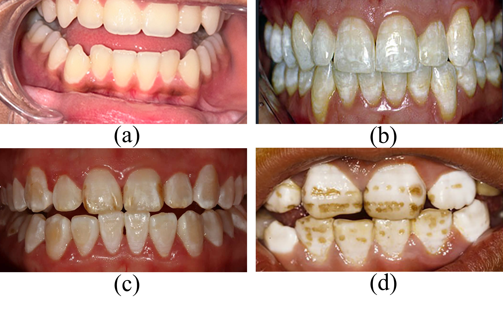

# DOFNet: An Overview-Focus Convolution and Dual-Path Attention Integrated Network for Dental Fluorosis and Caries Diagnosis

## Introduction

We propose a lightweight and efficient framework for dental fluorosis and  dental caries classification.

The proposed method introduces:

* **OFConv (Overview-Focus Convolution)** for enhancing convolutional networks model long-range dependencies
* **DBA (Dual-Path Attention)** for reducing the computational complexity of self-attention
* **DCF (Deep Channel Fusion)** for enhancing the integration of lesion characteristics across different levels to minimize information loss.

The network achieves competitive performance while maintaining low computational complexity.

---

## Framework

<p align="center">
  
</p>

Overview of the proposed DOFNet architecture.

---

## Dataset

### OpenDF

The OpenDF dataset contains 450 dental images categorized into four severity levels:

<p align="center">
  
</p>

---

## Environment

### 1. Clone the repository

```
git clone https://github.com/eniac-ll/DOFNet.git
cd DOFNet
```

### 2.Create Conda Environment

For conda environment:

```bash
conda env create -f environment.yml
conda activate dofnet
```

 for pip :

```bash
pip install -r requirements.txt
```

### 3.Requirements

See the file requirements.

---

## Visualization


### Grad-CAM

<p align="center">
  
</p>


---

## Citation

If you find this work useful, please consider citing:

```bibtex

```

---

## Acknowledgement

This work is supported by College of Computer Science and Technology, Guizhou University, China

---

## Contact

For questions or collaborations, please contact:

Email: [yunwu@gzu.edu.cn](mailto:your_email@xxx.com)
